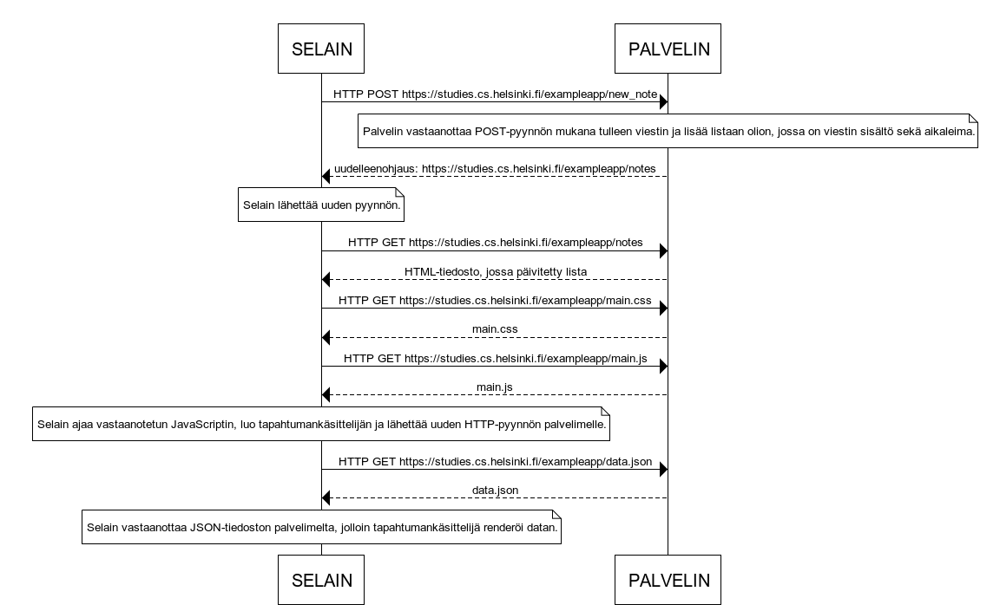

# 0.4


```
SELAIN->PALVELIN: HTTP POST https://studies.cs.helsinki.fi/exampleapp/new_note

note over PALVELIN:
Palvelin vastaanottaa POST-pyynnön mukana tulleen viestin ja lisää listaan olion, jossa on viestin sisältö sekä aikaleima.
end note

PALVELIN-->SELAIN: uudelleenohjaus: https://studies.cs.helsinki.fi/exampleapp/notes

note over SELAIN:
Selain lähettää uuden pyynnön.
end note

SELAIN->PALVELIN: HTTP GET https://studies.cs.helsinki.fi/exampleapp/notes

PALVELIN-->SELAIN: HTML-tiedosto, jossa päivitetty lista

SELAIN->PALVELIN: HTTP GET https://studies.cs.helsinki.fi/exampleapp/main.css

PALVELIN-->SELAIN: main.css

SELAIN->PALVELIN: HTTP GET https://studies.cs.helsinki.fi/exampleapp/main.js

PALVELIN-->SELAIN: main.js

note over SELAIN:
Selain ajaa vastaanotetun JavaScriptin, luo tapahtumankäsittelijän ja lähettää uuden HTTP-pyynnön palvelimelle.
end note

SELAIN->PALVELIN: HTTP GET https://studies.cs.helsinki.fi/exampleapp/data.json

PALVELIN-->SELAIN: data.json

note over SELAIN:
Selain vastaanottaa JSON-tiedoston palvelimelta, jolloin tapahtumankäsittelijä renderöi datan.
end note
```
